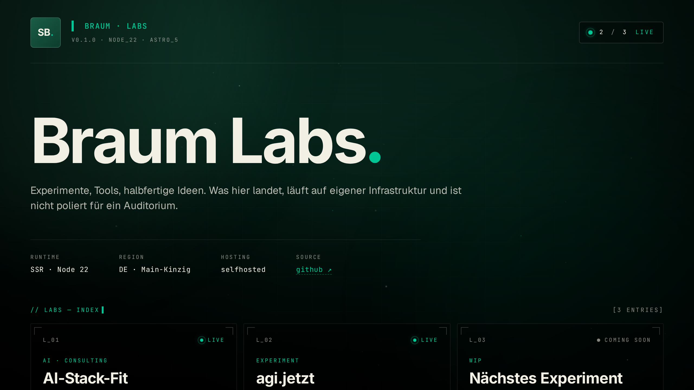

# braum.dev — Public Labs

Public hub for small tools, experiments, and half-finished ideas. Some labs live on this domain (`/labs/<slug>`), others have their own domain and are linked out.

**Live:** [braum.dev](https://braum.dev) · **Sister site:** [braum.org](https://braum.org) (AI-Stack-Fit standalone)



## Stack

- Astro 5 standalone SSR (`@astrojs/node`)
- TypeScript strict mode
- React 18 islands (used only where state matters)
- Tailwind 4 + CSS variables
- Self-hosted Inter / Geist / JetBrains Mono via `@fontsource-variable`
- GSAP + ScrollTrigger for animation
- Biome for lint and format
- Multi-stage Dockerfile, runs as non-root on Node 22-alpine
- Umami self-hosted analytics (env-driven)
- Pre-rendered, brand-locked OG cards (`@resvg/resvg-js`)

## Quick start

```bash
pnpm install
cp .env.example .env
pnpm dev              # http://localhost:4323
```

## Scripts

| Command          | Action                                              |
| ---------------- | --------------------------------------------------- |
| `pnpm dev`       | Local dev server (port 4323)                        |
| `pnpm build`     | Type check + production build                       |
| `pnpm preview`   | Serve the built output                              |
| `pnpm check`     | `astro check && tsc --noEmit`                       |
| `pnpm lint`      | Biome lint                                          |
| `pnpm format`    | Biome write-formatter                               |
| `pnpm og:build`  | Re-render the OG cards in `public/og/` from SVG     |

## Layout

```
src/
├── components/
│   ├── labs/shared/    # LabHeader, LabFooter, LabDetail, LabBoot
│   └── ui/             # Eyebrow, etc.
├── layouts/            # BaseLayout
├── lib/                # env, track helpers
├── pages/
│   ├── index.astro     # Lab index with tile grid
│   ├── labs/<slug>/    # Lab detail pages (one Astro page per lab)
│   ├── 404.astro
│   └── api/health.ts   # Container probe
├── scripts/            # animations.client.ts (GSAP setup + tracking binding)
└── styles/global.css
```

## Adding a new lab

For an in-house lab (lives at `/labs/<slug>`):

1. Create `src/components/labs/<slug>/` with React component + scoped CSS (if interactive)
2. Create `src/pages/labs/<slug>/index.astro` (detail page, uses `LabDetail.astro` template)
3. (optional) Create `src/pages/labs/<slug>/run.astro` if there is an interactive runtime
4. Add a tile entry in `src/pages/index.astro`

For an external lab (lives on its own domain):

1. Add a tile entry in `src/pages/index.astro` with `external: true` and `detailHref: "https://<lab>.tld"`
2. The tile renders a `↗`-glyph, opens in new tab, no detail page

## Container

```bash
docker build -t braum-dev .
docker run --rm -p 4323:4323 \
  -e PUBLIC_SITE_URL=https://your.domain \
  -e UMAMI_SCRIPT_URL=... \
  -e UMAMI_WEBSITE_ID=... \
  braum-dev
```

`HEALTHCHECK` hits `GET /api/health` every 30 s. The healthcheck reads
`PORT` at runtime, so an orchestrator may override the default 4323.

## OG cards

Per-lab social-share PNGs are pre-rendered at build time from the SVG
templates in `src/lib/og.ts`, written to `public/og/<slug>.png`. Brand
fonts (Inter, Geist, JetBrains Mono — all OFL) live in `assets/fonts-og/`
and are loaded only by the build script, not shipped to clients.

```bash
pnpm og:build
```

`BaseLayout.astro` rewires `og:image` and `twitter:image` per page based
on `pageType="lab"` + `labSlug="<slug>"`.

## License

MIT — see [LICENSE](LICENSE).
